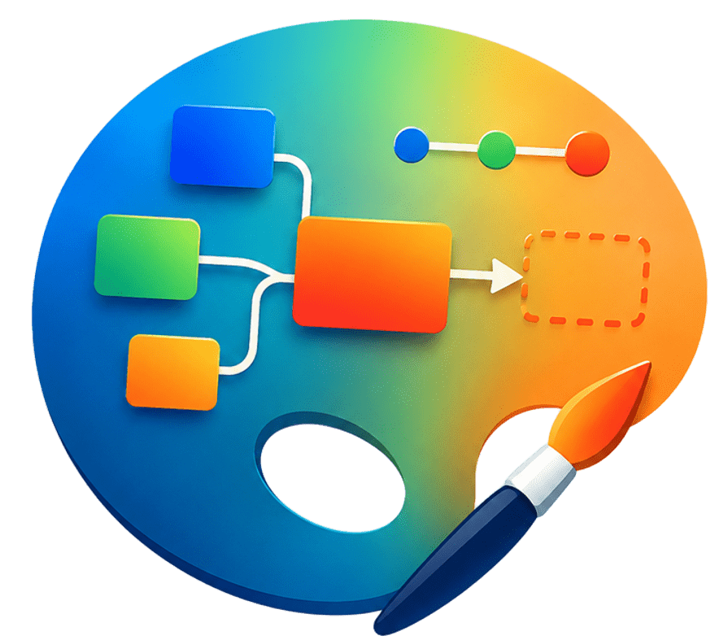
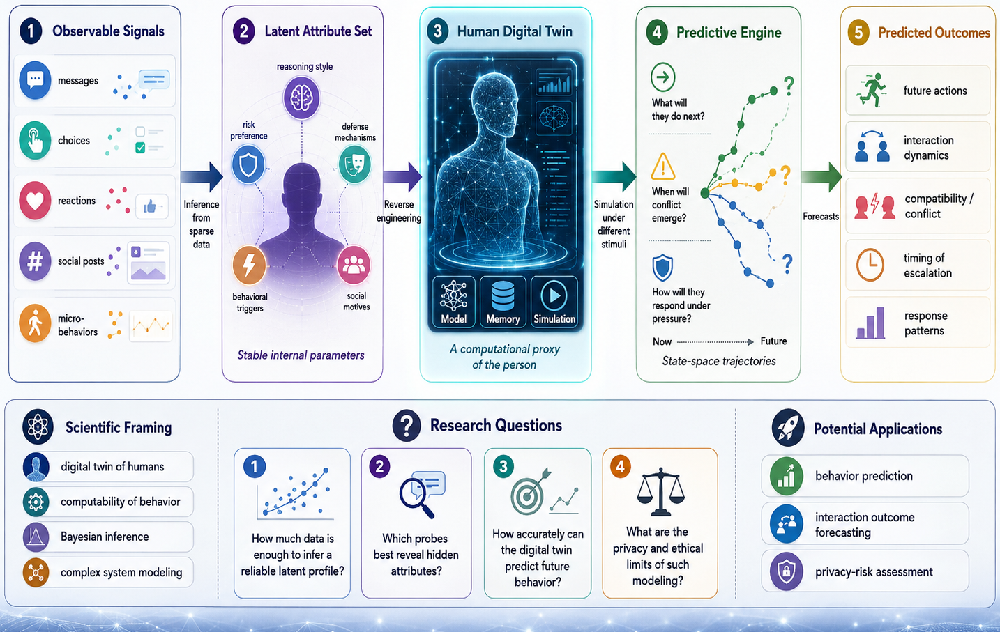
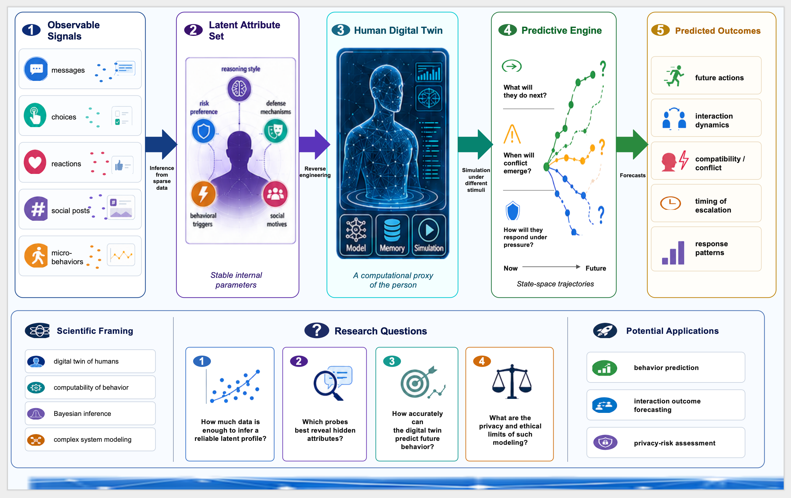
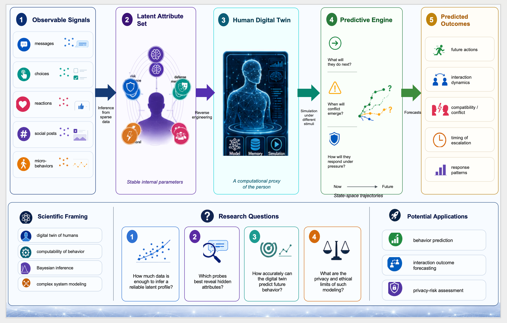

# RemixFig 

Turn any AI-generated academic figure into a fully editable PowerPoint in 5 prompts.

RemixFig is an open-source prompt workflow for researchers who generate beautiful framework diagrams with AI tools but need an editable version for their papers. No code, no installation, no API key required.


## The Problem and Solution

AI tools like ChatGPT and Gemini can generate stunning academic figures. But the output is always a flat PNG. You cannot edit the text, move the boxes, or swap the icons. Recreating the same figure from scratch in PowerPoint loses all the visual quality.

RemixFig is a 5-step prompt sequence that instructs ChatGPT to analyze your figure, extract every element as structured data, rebuild the layout as a native PowerPoint, regenerate all icons at high quality, and assemble the final editable file. The result is a .pptx where every box, text label, arrow, and icon is independently editable.


## Demo 

The demo video shows the complete 5-step process using a sample academic framework diagram as input.

Step 1 sends the figure to ChatGPT and receives a detailed JSON describing every element in the diagram including boxes, text labels, arrows, and icons with percentage-based coordinates and style attributes. Step 2 uses that JSON to generate an initial editable PowerPoint file where all boxes, text, and arrows are native PowerPoint shapes. At this stage the icons are embedded as low-resolution screenshots and may not look sharp. Step 3 asks GPT to regenerate every icon from the original figure as a clean high-quality vector-style version arranged on a blank canvas, along with a JSON mapping each icon to its original position. Step 4 extracts precise coordinate and attribute data for each icon. Step 5 replaces the low-resolution icon screenshots in the editable PowerPoint with the high-quality icons from Step 3, placed at their precise original positions.

The final output may still require minor manual adjustments in PowerPoint, such as repositioning a text box or resizing an element. The video ends by opening the output PPTX in PowerPoint and clicking through individual elements to demonstrate that every box, text label, arrow, and icon is independently editable.

Input (AI-generated PNG)



Output EN (English editable PPTX screenshot)



Download: [demo/output_en.pptx](demo/output_en.pptx)

[Watch English demo video](demo/walkthrough_en.mp4)

Output ZH (Chinese editable PPTX screenshot)



Download: [demo/output_zh.pptx](demo/output_zh.pptx)

[Watch Chinese demo video](demo/walkthrough_zh.mp4)


## How to Use 🚀

Open a new ChatGPT conversation. Upload your figure as a PNG or JPG. Then send the 5 prompts below one at a time, waiting for GPT to fully respond before sending the next.


English version: See [prompts/en.md](prompts/en.md)

Chinese version: See [prompts/zh.md](prompts/zh.md)


## Requirements and Tips

A ChatGPT Plus account with GPT-5.5 access is required. No other tools or setup needed.

Use GPT-5.5. Earlier models produce inconsistent results.

Wait for each step to fully complete before sending the next prompt.

The JSON outputs in Steps 1 and 4 will be long. This is normal. Just scroll past and continue.

The final PPTX may need minor text box adjustments in a few places. The overall layout and icon placement will be accurate.

Icons that are 3D renders or photographs rather than flat vector icons will be preserved as images and may look slightly softer than the original.


## Citation 📚

If RemixFig helps your research workflow, please consider citing or starring this repo.

```bibtex
@misc{chen2026remixfig,
  author = {Chen, Yuyan},
  title = {RemixFig: A Prompt Workflow for Making AI-Generated Figures Editable},
  year = {2026},
  publisher = {GitHub},
  url = {https://github.com/Yukyin/RemixFig}
}
```


## License 📜

Noncommercial use is governed by `LICENSE` (PolyForm Noncommercial 1.0.0).  
Commercial use requires a separate agreement. See `COMMERCIAL_LICENSE.md`.

📨 Commercial inquiries: yolandachen0313@gmail.com

